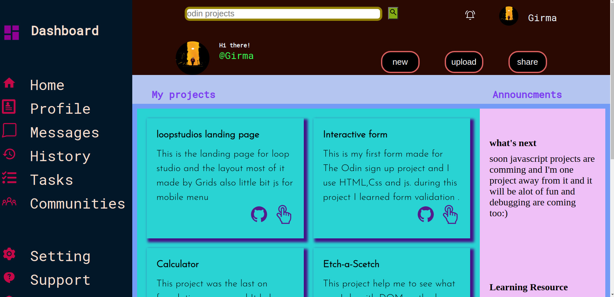

# admin-dashboard
This project was given to practice grid layout.
# built with
 -HTML
 -css
 -Grid
 # screenshot

*live site url [https://girma3.github.io/admin-dashboard/]

*In this project I learned nesting grid items inside grid containers.and I want to improve making it more responsive.